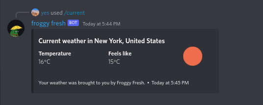

Froggy Fresh - Discord weather bot
======================================
Froggy Fresh is a simple Discord weather bot that returns current weather in the provided location. 

Setup
--------------------------------------
1. Setup .env file - `cp .env-example .env`
2. Add Discord bot token and OpenWeatherMap API key
    * Discord - https://discord.com/developers/docs/getting-started
    * OpenWeatherMap - https://openweathermap.org/appid
3. Setup virtual env - `./setup.sh`
    * You may need to run `chmod +x setup.sh`
4. Activate virtual env - `source bin/activate`
5. Run the bot - `python3 bot.py`

Usage
--------------------------------------
* Current weather - `/current [location]`
    * Query

        
    * Result

        

* Check bot's latency - `/ping`
    * Query

        
    * Result

        

